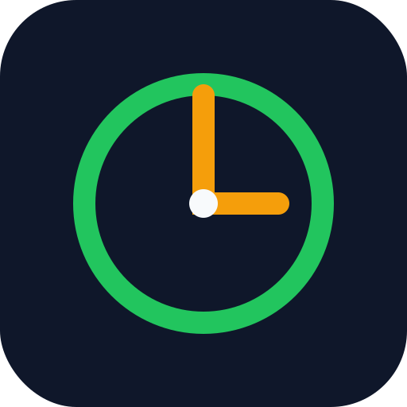

<div align="center">



# Brandt-Daroff — VPPB Home Treatment

A progressive web app that guides patients through the Brandt-Daroff exercises for BPPV (Benign Paroxysmal Positional Vertigo) at home.

</div>

---

> ⚠️ **Medical disclaimer**
>
> This app is a self-help guide and **is not a substitute for professional medical advice, diagnosis, or treatment**. Always consult your clinician before starting, and seek immediate medical review if you experience symptoms beyond your usual vertigo — **weakness, numbness in a limb, or vision changes**. An emergency-stop button is always reachable during an exercise cycle.

## What it is

An **offline-first PWA** that walks a patient, one screen at a time, through the Brandt-Daroff habituation protocol. It is designed to be used one-handed, on a phone, next to the bed, often while dizzy. There is **no backend, no login, and no data sent to a server** — everything is stored locally on the device.

Built mobile-first with large tap targets (≥ 56 px), high contrast, and large type. Available in **English · Català · Castellano**.

## Features

- **Onboarding wizard** with the Brandt-Daroff protocol defaults pre-filled (skippable):
  - Position duration: 30 s
  - Rest between positions: 30 s
  - Rest between cycles: 2 min
  - Sessions per day: 3 (Morning / Midday / Evening; or "Cycle 1, Cycle 2…" if changed)
  - Total treatment days: 14
  - 5 cycles per session is **fixed** (medical protocol)
- **Visual timer** — SVG circular progress ring + big countdown number
- **Position cards** — large illustration + short text + duration for each of the 5 positions
- **Cycle counter** — "Cycle 2/5", "3 cycles remaining"
- **Position-change cues** — sound + vibration + visual highlight (sound and vibration configurable, both can be silenced)
- **Early advance** — a "Dizziness has passed → Next" button lets the patient skip ahead on 30 s positions
- **Controls** — Play / Pause / Resume, Skip to next cycle, Reset whole process (confirmed), Stop and abandon (session stays pending and can be restarted)
- **Tracking** — calendar/grid of per-session, per-day state; global progress (completed sessions / total)
- **Clinical safety** — persistent warning for red-flag symptoms + an always-reachable emergency stop
- **Installable** — add to your home screen; works fully offline once loaded
- **Multilingual** — English / Català / Castellano, changeable at any time from Home

## Prerequisites

- **Node.js 18+** (Node 20 LTS recommended)

## Getting started

```bash
npm install
npm run dev
```

Open the printed local URL (usually `http://localhost:5173`). For the best experience, use a narrow mobile viewport (375 px wide) in your browser's devtools.

## Scripts

| Command | Description |
| --- | --- |
| `npm run dev` | Start the Vite dev server |
| `npm run build` | Type-check (`tsc --noEmit`) and build to `dist/` |
| `npm run preview` | Preview the production build |
| `npm run lint` | Run ESLint |
| `npm run typecheck` | Run `tsc --noEmit` |

## Tech stack

- **React 18 + Vite 5 + TypeScript**
- **Tailwind CSS 3** — mobile-first, large tap targets, high contrast
- **vite-plugin-pwa** — offline + installable
- **zustand** + `localStorage` — state and persistence, no backend
- **react-i18next** (`i18next`) with `src/i18n/{en,ca,es}`
- **lucide-react** icons + custom inline SVG for position illustrations and flag badges (Catalan flag has no emoji)
- **Web Audio API** (beep) + **navigator.vibrate** — both configurable
- **Capacitor-ready** layout for a future Android/iOS wrapper

## Project structure

```
src/
  main.tsx
  App.tsx
  types.ts
  index.css
  i18n/
    index.ts
    languages.ts
    resources.ts
  store/
    useTreatmentStore.ts
  components/
    LanguageSelector.tsx
    Wizard.tsx
    Home.tsx
    CycleSession.tsx
    Timer.tsx
    PositionIcon.tsx
    Calendar.tsx
    SafetyNotice.tsx
    Settings.tsx
    InfoScreen.tsx
    Modal.tsx
    Logo.tsx
  data/
    positions.ts
  utils/
    timer.ts
    sound.ts
    vibration.ts
    date.ts
public/
  icon.svg
```

## Install as a PWA

1. Open the deployed URL in your mobile browser.
2. **Chrome (Android):** menu → *Add to Home screen*.
3. **Safari (iOS):** Share → *Add to Home Screen*.

Once installed, the app works fully offline — no signal needed.

## Data & privacy

All state is stored in the browser's `localStorage` on the device:

- language and configuration
- treatment start date
- completed sessions and history
- sound / vibration settings

**Nothing leaves the device.** There is no analytics, no tracking, no network calls. The whole treatment can be reset from Home at any time (with confirmation).

## Deployment

The app is a static build, so any static host works. Recommended: **GitHub Pages** (this repo is already on GitHub) via a `gh-pages` branch or a GitHub Actions workflow that builds and publishes `dist/`.

Alternatives (all free tier): Netlify, Vercel, Cloudflare Pages.

## Roadmap

- **Capacitor** wrapper for native Android/iOS distribution
- **Local notifications** for session reminders
- Isolatable data layer for optional future sync

## License

[MIT](LICENSE) © Manel Alcoceba